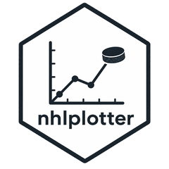

# nhlplotter <a href="https://rentosaijo.github.io/nhlplotter/"></a>

### Overview

nhlplotter is an R package for visualizing National Hockey League data from the companion R package `nhlscraper`. It provides tools for custom and preset plots.

### Installation

Install the development version from [GitHub](https://github.com/) with:

```r
install.packages('pak')
pak::pak('RentoSaijo/nhlplotter')
```
